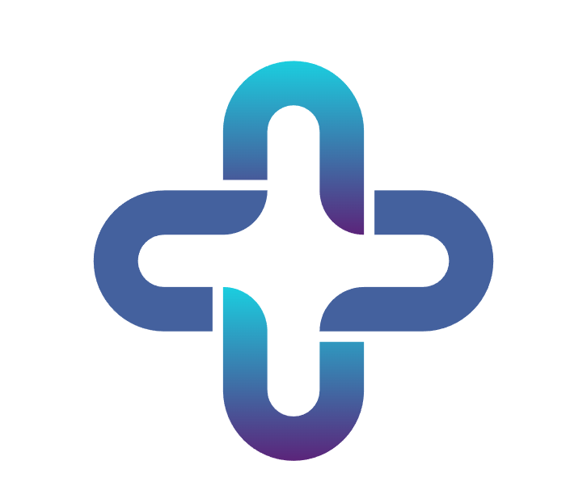

<p align="center">
  
</p>

<h1 align="center">HealthSync</h1>

<p align="center">
  <strong>A modern telemedicine and healthcare management platform</strong><br/>
  Built with React 19 · Supabase · Vite · TailwindCSS
</p>

<p align="center">
  
  
  
  
  
</p>

---

## Table of Contents

- [Overview](#overview)
- [Tech Stack](#tech-stack)
- [Project Structure](#project-structure)
- [Frontend Architecture](#frontend-architecture)
  - [Routing & Navigation](#routing--navigation)
  - [Role-Based Portals](#role-based-portals)
  - [Authentication Flow](#authentication-flow)
  - [Real-Time Systems](#real-time-systems)
  - [Component Architecture](#component-architecture)
  - [Design System](#design-system)
- [Key Features](#key-features)
- [Environment Variables](#environment-variables)
- [Getting Started](#getting-started)
- [Deployment](#deployment)

---

## Overview

**HealthSync** is a full-featured telemedicine web application that connects patients with verified medical professionals. It provides three distinct role-based portals — **Patient**, **Doctor**, and **Admin** — each with its own dashboard, navigation, and feature set. The frontend is a React SPA powered by Supabase for authentication, database, real-time messaging, file storage, and presence tracking.

---

## Tech Stack

| Layer | Technology | Purpose |
|---|---|---|
| **Framework** | React 19 + Vite 7 | SPA with HMR and fast builds |
| **Styling** | TailwindCSS 3.4 + Custom CSS | Utility-first styling with design tokens |
| **Routing** | React Router DOM 7 | Client-side routing with catch-all redirects |
| **Backend-as-a-Service** | Supabase JS 2.90 | Auth, PostgreSQL, Realtime, Storage |
| **Animations** | Framer Motion 12 | Page transitions and micro-animations |
| **Icons** | Lucide React | Consistent icon system across all portals |
| **Charts** | Recharts 3.8 | Analytics dashboards (admin portal) |
| **Video Calls** | Jitsi React SDK | Peer-to-peer tele-consultations |
| **PDF Generation** | jsPDF 4.2 | Prescription and report exports |
| **Notifications** | React Hot Toast | Toast-style user feedback |
| **Deployment** | Vercel | SPA hosting with rewrite rules |

---

## Project Structure

```
mini/
├── index.html                  # HTML entry point (loads fonts, favicon)
├── vite.config.js              # Vite configuration with React plugin
├── tailwind.config.js          # TailwindCSS content paths
├── postcss.config.js           # PostCSS pipeline (Tailwind + Autoprefixer)
├── vercel.json                 # Vercel SPA rewrite rules
├── package.json                # Dependencies and scripts
│
├── public/
│   └── Print.svg               # Favicon
│
└── src/
    ├── main.jsx                # React DOM entry point (StrictMode)
    ├── App.jsx                 # Root component — routing + auth listener
    ├── App.css                 # App-level styles
    ├── index.css               # Global styles, design tokens, animations
    ├── supabaseClient.js       # Supabase client singleton
    │
    ├── assets/
    │   └── healthsync-logo.png # Brand logo
    │
    ├── lib/
    │   └── presence.js         # Supabase Realtime Presence system
    │
    ├── layouts/
    │   └── PublicLayout.jsx    # Navbar + Outlet wrapper for public pages
    │
    ├── components/             # Shared, reusable components
    │   ├── Navbar.jsx          # Public navigation bar (responsive)
    │   ├── GlassCard.jsx       # Glassmorphism card wrapper
    │   ├── NotificationBell.jsx# Real-time notification dropdown
    │   ├── ChatList.jsx        # Chat conversation list (used by both roles)
    │   ├── ChatWindow.jsx      # Full chat interface with rich features
    │   ├── AudioMessage.jsx    # Waveform audio message player
    │   └── Videocall.jsx       # Jitsi-powered video call component
    │
    └── pages/
        ├── Home.jsx            # Landing page with feature slider
        ├── About.jsx           # About page
        ├── Login.jsx           # Login form with Supabase auth
        ├── Register.jsx        # Registration (Patient/Doctor role selector)
        ├── CompleteProfile.jsx  # Post-registration profile completion
        ├── ForgotPassword.jsx  # Password recovery flow
        │
        ├── patient/            # Patient portal screens
        │   ├── PatientDashboard.jsx    # Main dashboard shell + sidebar
        │   ├── Appointments.jsx        # Browse & book appointments
        │   ├── MyAppointments.jsx      # View booked appointments
        │   ├── PatientPrescriptions.jsx# View prescriptions
        │   ├── PatientProfile.jsx      # Profile settings & avatar
        │   ├── PatientComplaints.jsx   # File complaints
        │   └── MedicalRecords.jsx      # Medical records / reports
        │
        ├── doctor/             # Doctor portal screens
        │   ├── DoctorDashboard.jsx     # Main dashboard shell + sidebar
        │   ├── DoctorDashboardHome.jsx # Dashboard home with stats
        │   ├── DoctorAppointments.jsx  # Manage booked patients
        │   ├── DoctorConsultation.jsx  # Active consultations
        │   ├── AppointmentCreator.jsx  # Set availability slots
        │   ├── Profile.jsx            # Doctor profile management
        │   └── DoctorComplaints.jsx   # Handle patient complaints
        │
        └── admin/              # Admin portal screens
            ├── AdminLogin.jsx              # Separate admin login
            ├── AdminDashboard.jsx          # Admin dashboard shell
            ├── UserDirectory.jsx           # Browse all users
            ├── DocRegisterer.jsx           # Approve doctor registrations
            ├── AdminDoctorAnalytics.jsx    # Doctor analytics (Recharts)
            ├── AdminPatientAnalytics.jsx   # Patient analytics (Recharts)
            ├── AdminComplaints.jsx         # Manage complaints
            └── AdminForgotPasswordRequests.jsx # Handle password resets
```

---

## Frontend Architecture

### Routing & Navigation

The app uses **React Router v7** with a flat route structure defined in `App.jsx`. All routes are wrapped in a single `<BrowserRouter>`:

```
/                    → Home (landing page)
/about               → About
/login               → Patient/Doctor login
/register            → Registration (role selector)
/complete-profile    → Post-registration profile completion
/forgot-password     → Password recovery

/patient-dashboard   → Patient portal (all sections via internal nav)
/doctor-dashboard    → Doctor portal (all sections via internal nav)

/admin               → Admin login (separate auth)
/admin-dashboard     → Admin portal (all sections via internal nav)

/*                   → Redirect to /
```

> **Note:** Each dashboard is a **single route** that manages its own internal tab-based navigation via local state (`activePage` / `activeTab`), not nested routes. This keeps the sidebar navigation instant with no route-level re-renders.

### Role-Based Portals

The application is divided into three isolated portals, each with its own dashboard shell:

```
┌─────────────────────────────────────────────────┐
│                    App.jsx                       │
│  (Auth listener + BrowserRouter + Route map)     │
├────────────────┬────────────────┬────────────────┤
│  PatientDash   │  DoctorDash    │  AdminDash     │
│  ┌──────────┐  │  ┌──────────┐  │  ┌──────────┐  │
│  │ Sidebar  │  │  │ Sidebar  │  │  │ Sidebar  │  │
│  │ + Mobile │  │  │ + Mobile │  │  │ + Mobile │  │
│  │  Header  │  │  │  Header  │  │  │  Header  │  │
│  ├──────────┤  │  ├──────────┤  │  ├──────────┤  │
│  │  Main    │  │  │  Main    │  │  │  Main    │  │
│  │ Content  │  │  │ Content  │  │  │ Content  │  │
│  │ (tabbed) │  │  │ (tabbed) │  │  │ (tabbed) │  │
│  └──────────┘  │  └──────────┘  │  └──────────┘  │
└────────────────┴────────────────┴────────────────┘
```

Each portal follows the same **shell pattern**:
1. **Sidebar** — Fixed left panel with navigation items (icon + label), user profile card, and logout button
2. **Mobile Header** — Sticky top bar with hamburger menu (visible on `< lg` breakpoints)
3. **Mobile Overlay** — Backdrop blur overlay when sidebar is open on mobile
4. **Main Content Area** — Renders the active tab component based on local state

Role validation happens on mount — each dashboard fetches the user's profile from Supabase, checks the `role` field, and redirects unauthorized users.

### Authentication Flow

```
┌──────────┐     ┌─────────────┐     ┌──────────────────┐
│  Login   │────▶│  Supabase   │────▶│  Check Profile   │
│  Page    │     │  Auth       │     │  (role + status)  │
└──────────┘     └─────────────┘     └────────┬─────────┘
                                              │
                     ┌────────────────────────┼────────────────┐
                     ▼                        ▼                ▼
              Patient (active)         Doctor (active)    Doctor (pending)
              → /patient-dashboard     → /doctor-dashboard → "Pending" toast
                     │                        │
                     ▼                        ▼
              Profile complete?        Profile complete?
              → /complete-profile      → /complete-profile
```

- **Session persistence** is handled via `supabase.auth.onAuthStateChange()` in `App.jsx`
- Dashboard components are keyed by `session?.user?.id` to force re-mount on user switch
- Doctor accounts require **admin approval** before access is granted (`status: "pending" → "active"`)
- Profile completeness is enforced — missing required fields trigger a redirect to `/complete-profile`

### Real-Time Systems

HealthSync uses **three real-time mechanisms** layered for reliability:

#### 1. Supabase Realtime (Postgres Changes)
Used for instant message delivery in the chat system. The `ChatWindow` subscribes to `INSERT` and `UPDATE` events on the `chat_messages` table, filtered by `booking_id`.

#### 2. Supabase Presence
Used for online/offline status tracking. Each chat session creates a presence channel where both participants track their state. The `lib/presence.js` module provides a global presence system for the app.

#### 3. Polling Fallback
A 3-second polling interval in `ChatWindow` and a 10-second `last_seen` polling fallback ensure messages and online status are always accurate, even if WebSocket connections drop.

```
ChatWindow.jsx
├── Realtime Channel (postgres_changes) → instant message sync
├── Presence Channel → online/offline indicators
└── Polling Fallback (3s interval) → reliability layer
```

### Component Architecture

#### Shared Components (`/components`)

| Component | Responsibility |
|---|---|
| `Navbar` | Responsive public nav with active link highlighting (orange theme) |
| `GlassCard` | Reusable glassmorphism card with optional hover scale effect |
| `NotificationBell` | Fetches notifications from Supabase, shows unread badge + dropdown |
| `ChatList` | Lists all chat conversations for the current user (shared by patient & doctor) |
| `ChatWindow` | Full-featured chat: text, file upload, voice recording, edit/delete, expiry timer, presence |
| `AudioMessage` | Custom waveform audio player with progress bar and seek support |
| `VideoCall` | Jitsi Meet integration for encrypted peer-to-peer video consultations |

#### Key Design Decisions

- **No global state management** — Each dashboard manages its own state via `useState` / `useEffect`. Supabase acts as the single source of truth.
- **Composition over abstraction** — Components are large, self-contained units rather than deeply nested composites. This simplifies debugging and keeps the component tree shallow.
- **Inline tab rendering** — Dashboard shells use conditional rendering (`activePage === "x" && <Component />`) instead of nested routes, making tab switches instant.

### Design System

#### Typography

The app uses a multi-font system loaded via Google Fonts:

| Font | CSS Class | Usage |
|---|---|---|
| **Red Hat Display** | `.font-redhat` | Primary UI font (dashboards) |
| **Syne** / **Space Grotesk** | via `index.html` | Headings and display text |
| **DM Sans** | via `index.html` | Body text |
| **Dancing Script** | `.font-curvy` | Decorative accents |
| **Comfortaa** | `.font-comfortaa` | Soft UI elements |

#### Color Palette

| Token | Value | Usage |
|---|---|---|
| Primary Cyan | `#0BC5EA` | Active states, buttons, chat bubbles |
| Deep Blue | `#2B6CB0` | Gradient endpoints |
| Background | `#F7FAFC` | Dashboard backgrounds |
| Card BG | `#FFFFFF` | Cards and surfaces |
| Text Main | `#333333` | Primary text |
| Text Muted | `#828282` | Secondary text |
| Emergency Red | `#DC2626` | Emergency button + pulse animation |

#### Custom CSS Utilities

Defined in `index.css`:

- **`.seba-card`** — White card with 24px border radius + soft shadow
- **`.seba-glass`** — Glassmorphism effect (blur + translucent white)
- **`.no-scrollbar`** — Hidden scrollbar (webkit + Firefox)
- **`.animate-fadeIn`** — Fade-in with subtle upward slide
- **`.emergency-pulse`** — Pulsing red box-shadow animation for the emergency button

---

## Key Features

### Patient Portal
- 📅 **Appointment Booking** — Browse available doctors and book consultation slots
- 💬 **Real-time Chat** — Text, voice messages, file attachments with edit/delete
- 📹 **Video Consultations** — Jitsi-powered encrypted video calls
- 💊 **Prescriptions** — View doctor-issued prescriptions
- 🗂️ **Medical Records** — Upload and manage medical reports
- 🚨 **Emergency Contacts** — One-tap access to emergency services (24/7 modal)
- 🔔 **Notifications** — Real-time notification bell with unread badge

### Doctor Portal
- 👥 **Patient Management** — View and manage booked patients
- 📋 **Consultations** — Active consultation interface
- 📆 **Availability** — Create and manage appointment slots
- 💬 **Chat** — Communicate with patients (shared chat system)
- 👤 **Profile** — Manage professional profile and avatar

### Admin Portal
- 👥 **User Directory** — Browse and manage all platform users
- ✅ **Doctor Approvals** — Review and approve doctor registrations
- 📊 **Analytics** — Doctor and patient analytics dashboards (Recharts)
- 📩 **Complaints** — Manage platform complaints with badge counters
- 🔑 **Password Resets** — Handle forgot-password requests

---

## Environment Variables

Create a `.env` file in the project root:

```env
VITE_SUPABASE_URL=your_supabase_project_url
VITE_SUPABASE_ANON_KEY=your_supabase_anon_key
```

Both values are available from your [Supabase Dashboard](https://app.supabase.com) → Project Settings → API.

---

## Getting Started

```bash
# Clone the repository
git clone https://github.com/your-username/healthsync.git
cd healthsync

# Install dependencies
npm install

# Start development server
npm run dev
```

The app will be available at `http://localhost:5173`.

### Available Scripts

| Script | Command | Description |
|---|---|---|
| `dev` | `npm run dev` | Start Vite dev server with HMR |
| `build` | `npm run build` | Production build to `/dist` |
| `preview` | `npm run preview` | Preview production build locally |
| `lint` | `npm run lint` | Run ESLint checks |

---

## Deployment

The app is configured for **Vercel** deployment with SPA rewrite rules in `vercel.json`:

```json
{
  "rewrites": [
    { "source": "/(.*)", "destination": "/index.html" }
  ]
}
```

All routes are rewritten to `index.html` so React Router handles client-side navigation.

---

<p align="center">
  <sub>Built with ❤️ using React, Supabase & Vite</sub>
</p>
